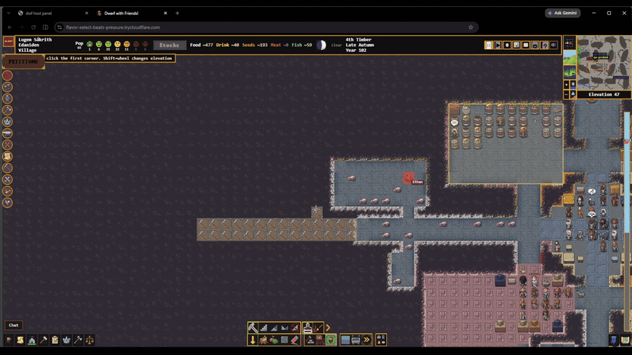
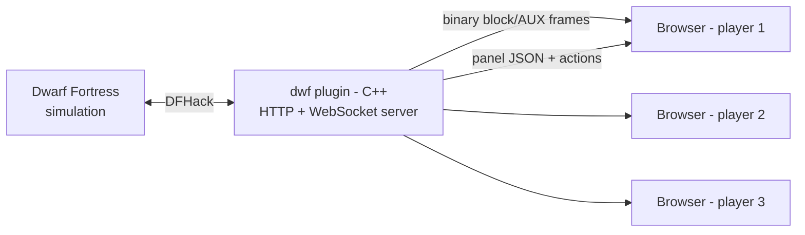
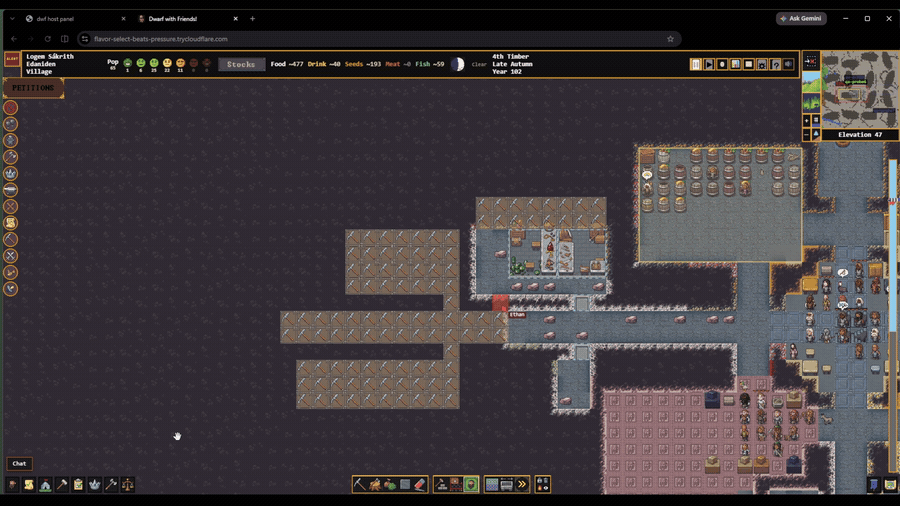

# Dwarf With Friends

Play one Dwarf Fortress fortress with your friends, at the same time, each from your own browser.
One person hosts the running game; everyone else clicks a link and they're in, no account or no
setup on their end. (Everyone playing should own a copy of Dwarf Fortress, grab it on Steam and
support Bay 12. This is about playing the game together, not around it.)

A lot of prior DF multiplayer projects were really cool but felt more like tech demos than a fun
way to actually play with friends. This one is built to close that gap: it's not a screen share,
every player gets their own camera, their own cursor, real controls, native-style panels, a WebGL
renderer, and the game's own art and audio, live in the browser. You can see everyone's cursor
moving around the fort with their name on it. When someone drags out a mining designation, you
watch the box grow. It's the difference between watching someone play and *playing together*.

Dwarf With Friends is a [DFHack](https://github.com/DFHack/dfhack) plugin for Steam-era Dwarf
Fortress (v0.53.15, DFHack 53.15-r1). It's a **beta**: the everyday 90%+ of fortress play is built
and tested; the rare corners fall back to "ask the host" instead of pretending to work.



## How it works

The host loads the C++ plugin into their running game. The plugin reads and safely mutates the live
fortress and runs an embedded HTTP/WebSocket server that serves a dependency-free browser client.
The map streams as delta-compressed 16×16 blocks over a binary WebSocket protocol into a per-player
world cache; panels and actions travel over HTTP. Each browser renders and drives its own view, so
players pan, change z-levels, designate, build, and manage the fortress independently against the
one shared simulation.



For the full design, see [docs/ARCHITECTURE.md](docs/ARCHITECTURE.md); for the file-by-file index,
[docs/MAP.md](docs/MAP.md).

## Features

**Seeing each other**
- Everyone's cursor glides across the map in their own color with their name on it, smoothly
  interpolated and fading across z-levels
- Watch a friend's dig or designation box grow live as they drag it out
- Their camera viewport shows on your minimap; z-scrollbar markers show what depth everyone's on
- Ping any tile MOBA-style, everyone sees the expanding ring in your color and jump to the position or unit from the chat.
- Click a player and follow their camera live, until you move
- Built in chat with layer colors, join/leave notices, unread badges, and history that survives a reload



**Actually playing — ~130 real actions against the live fort**
- Designate digs, chops, plants, and traffic; place buildings, stockpiles, zones, and burrows
- Squads (schedules, uniforms, positions,), work orders, labors, nobles, justice, locations, hauling, stocks,
  kitchen, standing orders, and nicknames
- A attribution marker shows which players ordered certain workorders or items.

**Feels like real Dwarf Fortress**
- ~97 interactive screens rebuilt in HTML/CSS to match the Steam UI, screen by screen — except the
  windows are movable, resizable, and remember where you put them
- In most cases behavior is verified against reverse engineering of the actual game

**Sound & visuals**
- The host's own game music, ambience, and announcement stingers stream to every browser
  (basic but working; opt-out — see [docs/CONFIG.md](docs/CONFIG.md))
- High frame rate, adding additional players costs negligible preformance for the host. 
- A toggleable, orbitable 3D voxel view of the fort, built live from the same tile data
- Optional rain/snow weather particles (disable in settings menu)

**Built to hold up**
- The map streams as delta-compressed 16×16 blocks over a custom binary WebSocket protocol that
  scales with player count instead of linearly with it (see [How it works](#how-it-works))
- Reconnects are cheap: the client acknowledges what it has and can request a fresh keyframe, so
  nothing desyncs silently.
- Anyone can pause or unpause; the fort auto-pauses if someone disconnects; unpausing can be
  restricted to the host; host-side saving is guarded against collisions
- Runs on basically anything with a browser (technically even a phone, but good luck with that)

Sprite art is never redistributed: the plugin reads the host's own Dwarf Fortress installation and
each browser uploads only the cells it needs. A host running DF Classic (no premium art) still
works — friends see simple placeholders.

## Quickstart for players

The supported install is the one-click **DWF Setup.cmd** in the release zip. It also verifies and
repairs an existing install, so re-running it is always safe.

1. Download the `DwarfWithFriends` zip from the project's releases page (not a source archive).
2. Unzip it anywhere on a Windows PC and double-click **DWF Setup.cmd**.
3. Follow the setup page that opens in your browser, then open **Dwarf With Friends**, click
   **Start hosting**, load a fortress, and share the friend link (and a join password, if you set
   one — optional).

Friends join from their browser with the link. Full walkthrough: [docs/INSTALL.md](docs/INSTALL.md),
or [docs/MANUAL-INSTALL.md](docs/MANUAL-INSTALL.md) if you'd rather do it by hand (including a
Tailscale option instead of the default tunnel). If something gets in the way, see
[TROUBLESHOOTING.md](TROUBLESHOOTING.md). Found a bug?
[docs/REPORTING-BUGS.md](docs/REPORTING-BUGS.md) explains how to report it well — it's a beta,
and good reports get fixed fast.

## Honest limitations

The everyday flows are solid, that's what my friends and I actually play on. But occasionally
the host will need to tab back to the Steam client for things that aren't in yet: trading, some
niche corners of the justice and hospital systems, missions and diplomacy, and petition
decisions. Rebuilding the entire DF interface in a browser is hard, so there are UI quirks I
know about, and I'm planning a larger update fixing the jank for the next beta release. Windows host only.

This project was built almost entirely with AI coding tools (Claude Code and Codex) by someone
who is not a software engineer, but not as a one-shot prompt: it's been weeks of obsessive
iteration, testing against the native game, and cleanup to make this repo genuinely accessible
to poke around in. If you're smarter than me (likely), I'd love your corrections and PRs.

## Quickstart for developers

This repository is a source checkout for development; supported downloads come from the releases
page. The plugin builds as an external plugin inside a DFHack 53.15-r1 source tree (CMake target
`dfcapture_public`, output `dwf.plug.dll`); the browser client is plain JavaScript with no install
or bundling step.

```powershell
# Build the plugin (inside a configured DFHack 53.15-r1 tree; see BUILD.md for setup)
cmake --build <dfhack>/build-msvc --config Release --target dfcapture_public

# Run the full offline test battery from the repository root (no DF install needed)
node tools/release/launch_preflight.mjs --stage=suites
```

The browser UI was verified during development against an internal screenshot-parity studio that
renders the production DWFUI builders beside native Steam captures. That studio and its private
screenshot corpus are development-only and are not part of this public distribution.

- **Build:** [docs/BUILD.md](docs/BUILD.md) — prerequisites, the external-plugin layout, and install paths.
- **Develop:** [docs/DEVELOPMENT.md](docs/DEVELOPMENT.md) — onboarding, the test-harness culture,
  the DWFUI component rules, and where to add a new panel or endpoint.
- **Contribute:** [CONTRIBUTING.md](CONTRIBUTING.md), and read [AGENTS.md](AGENTS.md) first — its
  Dwarf Fortress safety rules are mandatory.

The client has no npm dependencies and the plugin vendors only `cpp-httplib` under `third_party/`.

## Repository layout

| Path | Contents |
|---|---|
| `src/` | The C++ DFHack plugin: transport, world streaming, per-family routes, and write guards. |
| `web/` | The browser client and its generated sprite/token JSON maps. |
| `web/js/` | The client's plain-script modules and the DWFUI shared component system. |
| `host/` | The zero-dependency Node installer and host-management UI. |
| `scripts/`, `dwf.lua` | DFHack Lua entry points, including the guarded native-write engine. |
| `tools/` | Offline builders, the test harness and gates, release packaging, and deploy helpers. |
| `docs/` | Architecture, build, install, configuration, naming, and the codebase map. |
| `third_party/` | Vendored dependencies (`cpp-httplib`). |

Some `dwf-*` and `dfcapture*` names describe an earlier implementation or a deliberately retained
runtime identity. Read [docs/NAMING.md](docs/NAMING.md) before assuming a name means stale code.

## Licence and lineage

Dwarf With Friends is licensed under **AGPL-3.0-only**; see [LICENSE](LICENSE). Because it serves
players over a network, the AGPL entitles anyone you host for to the source — which is this
repository.

It runs on **DFHack** (Zlib), grew out of **SourceAirbender's multi-dwarf / dfcapture**
(AGPL-3.0-only), and continues the multiplayer approach of **DFPlex** (Zlib), which itself builds
on **webfort** (ISC). It embeds **cpp-httplib** (MIT). Full attributions and third-party licence
texts are in [NOTICE](NOTICE).

