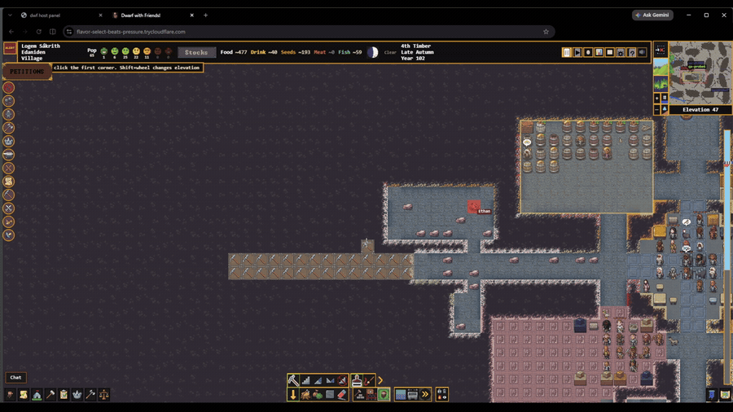
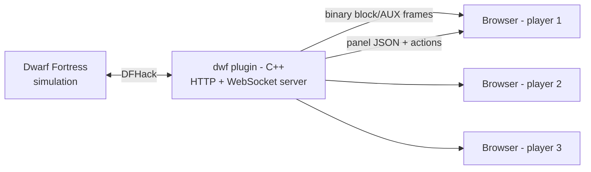
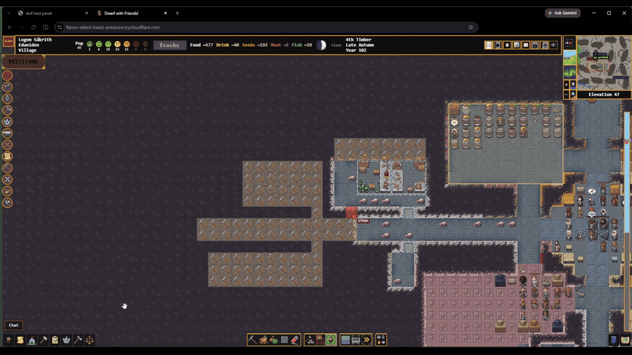

# Dwarf With Friends

[](LICENSE) [](https://github.com/JakesDwarfAccount/dwarf-with-friends/releases/tag/v1.0.0-beta.4.1) [](https://github.com/JakesDwarfAccount/dwarf-with-friends/actions/workflows/windows-native-build.yml)

### Download beta 4.1: [Windows](https://github.com/JakesDwarfAccount/dwarf-with-friends/releases/download/v1.0.0-beta.4.1/DwarfWithFriends-v1.0.0-beta.4.1.zip) · [Linux](https://github.com/JakesDwarfAccount/dwarf-with-friends/releases/download/v1.0.0-beta.4.1/DwarfWithFriends-v1.0.0-beta.4.1-linux.zip)

*(Those links are the ready-to-play release zips. The green "Code → Download ZIP" button is the source code: that's for developers, not for playing.)*

Play one Dwarf Fortress fortress with your friends, at the same time, each from your own browser.
One person hosts the running game; everyone else clicks a link and they're in, no account or
setup on their end. (Everyone playing should own a copy of Dwarf Fortress, grab it on Steam and
support Bay 12. This is about playing the game together, not around it.)

A lot of prior DF multiplayer projects were really cool but felt more like tech demos than a fun
way to actually play with friends. This one is built to close that gap: it's not a screen share,
every player gets their own camera, their own cursor, real controls, native-style panels, a WebGL
renderer, and the game's own art and audio, live in the browser. You can see everyone's cursor
moving around the fort with their name on it. When someone drags out a mining designation, you
watch the box grow. It's the difference between watching someone play and *playing together*.

Dwarf With Friends is a [DFHack](https://github.com/DFHack/dfhack) plugin for Steam-era Dwarf
Fortress (v0.53.16, DFHack 53.16-r1). It is a **beta** with substantial gameplay, rendering, and loading improvements. Some actions still require the host to use the native game.

Beta 4.1 fixes most of the interface regressions from beta 4. If something still gets in your way, [beta 3](https://github.com/JakesDwarfAccount/dwarf-with-friends/releases/tag/v1.0.0-beta.3) remains the more stable fallback. Its Windows and Linux packages require Dwarf Fortress 0.53.15 with DFHack 53.15-r2; beta 4 and 4.1 require Dwarf Fortress 0.53.16 with DFHack 53.16-r1. Follow beta 3’s own setup instructions in a compatible installation. Do not assume a save opened in a newer Dwarf Fortress version can be downgraded.

The project grew directly from Gabriel Rios's
[SourceAirbender/multi-dwarf](https://github.com/SourceAirbender/multi-dwarf) and retains that
project's copyright and AGPL license. [UPSTREAM.md](UPSTREAM.md) records what was inherited and what
Dwarf With Friends subsequently added.



## How it works

The host loads the C++ plugin into their running game. The plugin reads and safely mutates the live
fortress and runs an embedded HTTP/WebSocket server that serves a dependency-free browser client.
The map streams as delta-compressed 16×16 blocks over a binary WebSocket protocol into a per-player
world cache; panels and actions travel over HTTP. Each browser renders and drives its own view, so
players pan, change z-levels, designate, build, and manage the fortress independently against the
one shared simulation.


```mermaid
flowchart LR
    DF["Dwarf Fortress<br/>simulation"] <-->|DFHack| P["dwf plugin - C++<br/>HTTP + WebSocket server"]
    P -->|"binary block/AUX frames"| B1["Browser - player 1"]
    P -->|"panel JSON + actions"| B1
    P --> B2["Browser - player 2"]
    P --> B3["Browser - player 3"]
```

For the full design, see [ARCHITECTURE.md](docs/ARCHITECTURE.md); for the file-by-file index,
[MAP.md](docs/MAP.md).

## Features

**Seeing each other**
- Everyone's cursor glides across the map in their own color with their name on it, smoothly
  interpolated and fading across z-levels
- Watch a friend's dig or designation box grow live as they drag it out
- Their camera viewport shows on your minimap; z-scrollbar markers show what depth everyone's on
- Ping any tile MOBA-style: everyone sees the expanding ring in your color, and can jump to that
  position or unit from the chat
- Click a player and follow their camera live, until you move
- Built in chat with layer colors, join/leave notices, unread badges, and history that survives a reload



**Playing together**
- Designate digs, chops, plants, and traffic; place buildings, stockpiles, zones, and burrows
- Squads (schedules, uniforms, positions), work orders, labors, nobles, justice, locations, hauling,
  stocks, kitchen, standing orders, and nicknames
- Attribution markers show which player ordered a given work order or item

**Feels like real Dwarf Fortress**
- Native-style screens built in HTML/CSS, with
  movable, resizable windows that remember where you put them

**Sound & visuals**
- The host's own game music, ambience, and announcement stingers stream to every browser
  (basic but working; opt-out: see [CONFIG.md](docs/CONFIG.md))
- A toggleable, orbitable 3D voxel view of the fort, built live from the same tile data
- Optional rain/snow weather particles (disable in settings menu)

**Built to hold up**
- The map streams as delta-compressed 16×16 blocks over a custom binary WebSocket protocol that
  shares encoded map updates across players (see [How it works](#how-it-works))
- Reconnects are cheap: the client acknowledges what it has and can request a fresh keyframe, to recover missing map data.
- Anyone can pause or unpause; the fort auto-pauses if someone disconnects; unpausing can be
  restricted to the host; host-side saving is guarded against collisions
- Saving, returning to the menu, and quitting finish cleanly: beta.3 put firm timeouts on the
  waits that used to let any of the three hang forever
- Runs on basically anything with a browser (technically even a phone, but good luck with that)

Apart from the documented interface font, sprite art is not redistributed: the plugin reads the host's own Dwarf Fortress installation and
each browser uploads only the cells it needs. A host running DF Classic (no premium art) still
works: friends see simple placeholders.

## Quickstart for players

The supported install is the setup in the release zip. It can also verify an existing install and repair missing or stale mod files. Close Dwarf Fortress before updating.

1. Download the `DwarfWithFriends` zip that matches the machine running Dwarf Fortress: Windows or
   Linux: from the project's releases page (not a source archive).
2. Unzip it anywhere on that machine and run setup: double-click **DWF Setup.cmd** on Windows, or
   run `./dwf-setup.sh` from a terminal on Linux.
3. Follow the setup page that opens in your browser, then open **Dwarf With Friends** (the desktop
   shortcut setup creates, or the `Dwarf With Friends` launcher in the unzipped folder: same
   thing). The host panel opens in your browser; click **Start hosting**, load a fortress, and share
   the friend link (and a join password, if you set one: optional).

Friends join from their browser with the link. Full walkthrough: [INSTALL.md](docs/INSTALL.md),
or [MANUAL-INSTALL.md](docs/MANUAL-INSTALL.md) if you'd rather do it by hand (including a
Tailscale option instead of the default tunnel): both cover Windows and Linux hosts. If something gets in the way, see
[TROUBLESHOOTING.md](TROUBLESHOOTING.md). Found a bug?
[REPORTING-BUGS.md](docs/REPORTING-BUGS.md) explains how to report it well: it's a beta,
and clear reports help us investigate.

## Honest limitations

Some screens still have layout and visual issues. Trading, parts of justice and hospital management,
missions, diplomacy, and petition decisions may require the native game. Lever unlinking and
releasing animals from restraints remain disabled. The world map has limited browser functionality.

Hosting works on **Windows and Linux**: Linux since beta.3. Two things stay Windows-only because
they read the Windows game binary directly: the native map render behind per-player pan and zoom,
and native unit portraits. A Linux host serves the shared-camera fallback and placeholder portraits
instead, so players still get their own cursors and panels but share the host's view. Linux is also
much newer, and has had far less real-world play than Windows.

This project was built almost entirely with AI coding tools (Claude Code and Codex) by someone
who is not a software engineer, but not as a one-shot prompt: it's been weeks of obsessive
iteration, testing against the native game, and cleanup to make this repo genuinely accessible
to poke around in. If you're smarter than me (likely), I'd love your corrections and PRs ,
beta.3 shipped with two of them, from William Wilkins (`catagris`), including the Linux port.

## Quickstart for developers

This repository is a source checkout for development; supported downloads come from the releases
page. The plugin builds as an external plugin inside a DFHack 53.16-r1 source tree (CMake target
`dfcapture_public`, output `dwf.plug.dll` on Windows and `dwf.plug.so` on Linux); the browser client
is plain JavaScript with no install or bundling step.

Use Node 22 for the offline source checks:

```sh
node tools/harness/wire_decode_test.mjs
node tools/lua/build_dwf_lua.mjs --check
node tools/harness/stamp_busters.mjs --check
node tools/architecture/browser_dependency_inventory.mjs
```

These check the wire decoder and generated source assets; they do not validate live gameplay.

- **Build:** [BUILD.md](docs/BUILD.md): prerequisites, the external-plugin layout, and install paths.
- **Develop:** [DEVELOPMENT.md](docs/DEVELOPMENT.md): onboarding, the source checks,
  the DWFUI component rules, and where to add a new panel or endpoint.
- **Contribute:** [CONTRIBUTING.md](CONTRIBUTING.md), and read [AGENTS.md](AGENTS.md) first: its
  Dwarf Fortress safety rules are mandatory.

The client has no npm dependencies; the plugin vendors only `cpp-httplib` and `stb_image_write`
under `third_party/`.

## Repository layout

| Path | Contents |
|---|---|
| `src/` | The C++ DFHack plugin: transport, world streaming, per-family routes, and write guards. |
| `web/` | The browser client and its generated sprite/token JSON maps. |
| `web/js/` | The client's plain-script modules and the DWFUI shared component system. |
| `host/` | The zero-dependency Node installer and host-management UI. |
| `lua/`, `scripts/`, `dwf.lua` | DFHack Lua entry points, including the guarded native-write engine. |
| `tools/` | Source checks, asset builders, and release packaging. |
| `docs/` | Architecture, build, install, configuration, naming, and the codebase map. |
| `third_party/` | Vendored dependencies (`cpp-httplib`, `stb_image_write`). |

Some `dwf-*` and `dfcapture*` names describe an earlier implementation or a deliberately retained
runtime identity. Read [NAMING.md](docs/NAMING.md) before assuming a name means stale code.

## Licence and lineage

Dwarf With Friends is licensed under **AGPL-3.0-only**; see [LICENSE](LICENSE). Because it serves
players over a network, the AGPL entitles anyone you host for to the source: which is this
repository.

It runs on **DFHack** (Zlib), grew out of
**[SourceAirbender's multi-dwarf / dfcapture](https://github.com/SourceAirbender/multi-dwarf)**
(AGPL-3.0-only), and continues the multiplayer approach of **DFPlex** (Zlib), which itself builds
on **webfort** (ISC). It embeds **cpp-httplib** (MIT) and **stb_image_write** (MIT / public domain).
Full attributions and third-party licence texts are in [NOTICE](NOTICE).
