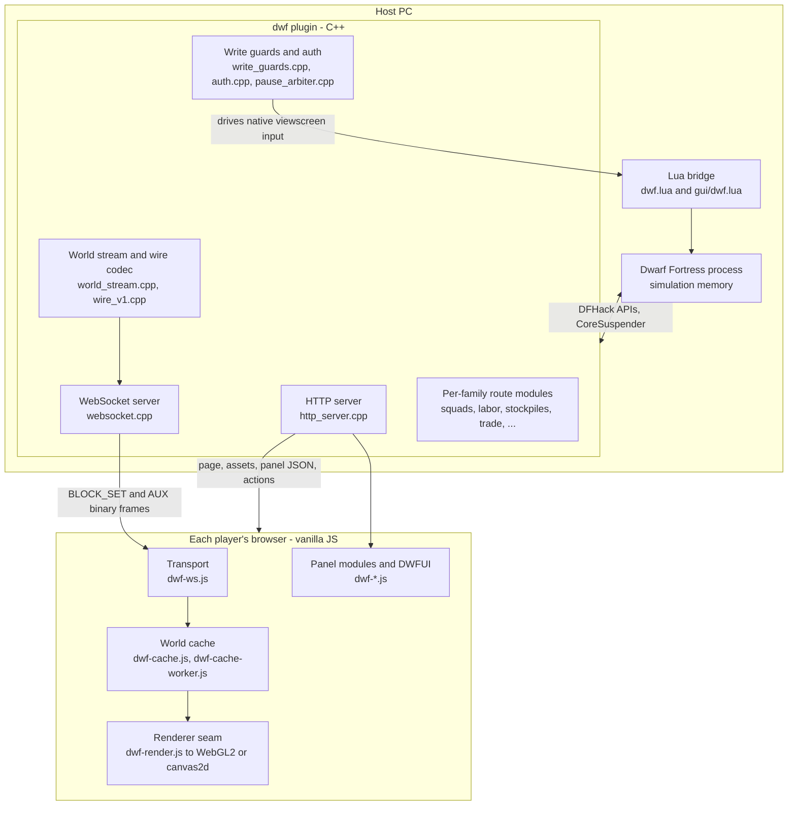

# Codebase map

A directory-and-file index for people who need to find the right file quickly. It complements
[ARCHITECTURE.md](ARCHITECTURE.md), which explains *why* the system is shaped this way, and the
per-directory `README.md` files, which carry the local rules. Names can mislead here; read
[NAMING.md](NAMING.md) before assuming a `dwf-*` or `dfcapture*` name means legacy code.

## Runtime architecture

One Dwarf Fortress process runs the simulation. The C++ plugin reads and mutates it under strict
locking and serves a browser client over HTTP and WebSocket. Each player's browser keeps its own
world cache, renderer, and camera.

## Top-level layout

| Path | Purpose |
|---|---|
| `src/` | The C++ DFHack plugin: transport, world reads, wire encoding, per-family routes, guards. See [src/README.md](../src/README.md). |
| `web/` | The zero-dependency browser client and its generated sprite/token JSON maps. See [web/README.md](../web/README.md). |
| `web/js/` | The client's plain-script modules. See [web/js/README.md](../web/js/README.md). |
| `host/` | Zero-dependency Node installer and host-management UI. See [host/README.md](../host/README.md). |
| `scripts/` | DFHack Lua entry points installed beside the plugin. See [scripts/README.md](../scripts/README.md). |
| `dwf.lua` | The plugin's Lua module, installed to `hack/lua/plugins/dwf.lua`; hosts the guarded native-write engine. |
| `tools/` | Offline builders, the test harness and gates, release packaging, and investigation utilities. See [tools/README.md](../tools/README.md). |
| `third_party/` | Vendored dependencies. Currently only `cpp-httplib` (the embedded HTTP/WebSocket library). |
| `docs/` | Architecture, build, install, configuration, naming, and this map. |
| `CMakeLists.txt` | Declares the external plugin target `dfcapture_public` with output name `dwf` (so the built artefact is `dwf.plug.dll`). |
| `AGENTS.md` | Mandatory safety contract for anyone changing the code. |

## `src/` — the C++ plugin

Every file carries the AGPL-3.0 header; purposes below come from each file's banner comment or,
where none exists, its leading code. `dwf.cpp` is the entry point: `DFHACK_PLUGIN("dwf")`,
`plugin_init` (registers the `capture-*` console commands), and `plugin_shutdown`. The HTTP server
starts separately in `http_server.cpp` and fans route registration out to the many
`register_*_routes()` modules.

### Server, transport, and web serving

| File | Purpose |
|---|---|
| `http_server.cpp/.h` | HTTP server lifecycle (`start_server`/`stop_server`, default port 8765) and aggregation of every `register_*_routes`. |
| `websocket.cpp/.h` | In-process RFC 6455 WebSocket server subclassing cpp-httplib; drives protocol-v1 push. |
| `world_stream.cpp/.h` | Protocol-v1 global single read pass: one interest-union scan per tick, encode-once, distribute to N connections. |
| `wire_v1.cpp/.h` | Protocol-v1 binary codec: frame header, tile record, `BLOCK_SET` assembly (`encode_block`). |
| `web_assets.cpp/.h` | Locates and serves the on-disk web root (`hack/dfcapture-web`) and `index.html`. |
| `session_routes.cpp/.h` | Session and server-meta routes: `/`, `/view`, `/health`, `/version`, `/join`, `/state`, `/camera`, `/follow`, `/save`. |
| `console_routes.cpp/.h`, `console_policy.h` | Browser DFHack-console routes and the header-only command deny table; gated by a host setting. |
| `oracle_routes.cpp/.h` | Harness-only test routes: `/host-state`, `/zoom-probe`, `/frame.jpg`, `/tiledump`. |
| `sound_route.cpp/.h` | Serves the host's own DF soundtrack as ranged Ogg behind a remote-play licensing gate; wires `/music`. |
| `music_sync.cpp/.h` | Server-authoritative synced music state (one canonical track and elapsed time for all clients). |
| `json_util.cpp/.h`, `route_helpers.h` | JSON escaping and query-param helpers; small shared route helpers. |

### World read, serialization, and render capture

| File | Purpose |
|---|---|
| `sdl_capture.cpp/.h` | The live camera model, render-thread coordination, capture locking, and the retained JPEG parity oracle. Owns `capture_state_mutex`. Not merely a screenshot module — see NAMING.md. |
| `tile_map_dump.cpp/.h` | Crash-safe tile streaming through stable map APIs to the older `wire:1` JSON `/mapdata` fallback. |
| `tile_dump.cpp/.h` | Render-buffer/atlas oracle tooling: one frame's tile-layer arrays plus a ground-truth PNG. |
| `image_encoder.cpp/.h` | Frame encoding to JPEG/PNG/BMP (GDI+ on Windows). |
| `sprite_map.cpp/.h` | Parses DF premium graphics raws into the token-to-sprite-cell lookup JSON the client renderer uses. |
| `curses_palette.cpp/.h` | DF's live 16-colour curses palette to RGB/JSON, shipped on the `/version` handshake. |
| `overlay_control.cpp/.h` | Disables and restores the DFHack `overlay` plugin while streaming. |
| `hud.cpp/.h` | The fort name/site/rank/population/happiness/food HUD payload. |
| `bake_sweep.cpp/.h`, `portrait_sweep.cpp/.h`, `unit_portrait.cpp/.h`, `unit_sprites.cpp/.h` | Paced, offscreen unit-portrait and per-unit-composite generation that never unpauses DF. |
| `camera.h`, `frame.h`, `surface_z.h`, `unit_status.h`, `unit_status_words.h` | Small shared structs and helpers (viewport, captured frame, recenter-surface, overhead-status bitfields). |

### Per-family gameplay panels and routes

| File | Purpose |
|---|---|
| `squads.cpp/.h` | Military squad routes. |
| `stockpile_panel.cpp/.h` | Stockpile info/rename/remove/links/storage/category/repaint. |
| `building_zone.cpp/.h` | Building and civic-zone inspect panel and zone routes. |
| `burrows_panel.cpp/.h` | Burrows panel, routes, and change broadcast. |
| `work_orders.cpp/.h` | Manager work-order routes. |
| `labor.cpp/.h` | Labor / work-detail routes. |
| `standing_orders.cpp/.h`, `stone_use.cpp/.h` | Standing-orders toggles; economic-stone toggles. |
| `info_panel.cpp/.h` | Info panel tabs for buildings/units/artifacts/occupations. |
| `kitchen_panel.cpp/.h` | Kitchen cook/brew panel. |
| `hospital.cpp/.h` | Hospital and health management. |
| `trade_depot.cpp/.h` | Depot state, caravan roster, mark-for-trade and trade-request mutations. |
| `unit_sheet.cpp/.h`, `unit_activity.cpp/.h`, `unit_activity_logic.h` | Unit detail sheet, current-task resolution, and the activity-precedence template. |
| `fort_admin.cpp/.h` | Nobles/administrators, justice, and petitions/agreements routes. |
| `hauling.cpp/.h`, `lever_link.cpp/.h` | Hauling-route panel; lever-linkage routes. |
| `placement.cpp/.h` | Designation and building-placement routes. |
| `worldmap_panel.cpp/.h`, `missions.cpp/.h` | World-map overlay routes; missions/raids screen. |
| `interaction.cpp/.h`, `interaction_route.h` | The `/inspect` click resolver and surface-click routing precedence. |
| `art_desc.cpp/.h`, `fort_stock.h` | Dwarven-art prose sourced only from DF fields; a shared include-aggregator header. |

### Guards, auth, pause, and multiplayer coordination

| File | Purpose |
|---|---|
| `write_guards.cpp/.h` | C++ binding of the fail-closed `dfcapture-hostwrites.json` guards and the `/write-guards` and `/console-config` routes. |
| `auth.cpp/.h` | Join security: shared-passphrase gate and the version-mismatch build stamp. |
| `pause_arbiter.cpp/.h` | Debounces and merges pause requests, auto-pauses on player leave, and broadcasts saving/busy state. |
| `vote.cpp/.h` | Fortress-elevation vote state and native land-holder-offer detection. |
| `client_state.cpp/.h` | Per-player camera cache and follow-target state. |
| `attribution.cpp/.h` | Records which player created each building/order/stockpile/zone; surfaced via `/attrib`. |

### Lua bridge, diagnostics, and messaging

| File | Purpose |
|---|---|
| `lua_bridge.cpp/.h` | Bridge to the `plugins.dwf` Lua module: build catalog, placement, stuck-squad mission rescue, guarded console run. |
| `diagnostics.cpp/.h` | Capture diagnostics counters, host state, and flight logging. |
| `flight_recorder.cpp/.h`, `flight_recorder_v3.cpp/.h` | Passive recording of DF screen arrays and backing memory for the ground-truth pipeline. |
| `menu_oracle.cpp/.h` | Crash-safe native menu read path that quiesces both DF threads before copying widget state (harness-only). |
| `status_harvest.cpp/.h`, `status_truth.cpp/.h` | Passive overhead-status harvest; a live bubble-vs-sheet cross-check that catches a stale DLL. |
| `chat.cpp/.h`, `notifications.cpp/.h`, `announcements.cpp/.h`, `announce_taxonomy.gen.h` | Chat relay and scrollback; announcement-alert feed; the reports/announcements log and its generated taxonomy. |
| `native_popup.cpp/.h`, `diplo.cpp/.h` | Mirrors of DF's native modal popups (readable and dismissable in the browser); the petitions/diplomacy detector. |

## `web/js/` — the browser client

These are classic `<script>` files, not ES modules: each registers a global (an IIFE namespace
object such as `DwfWS`, or plain functions dropped into global scope). Load order is fixed by the
`<script>` tag order in `web/index.html`; there is no bundler and no `import`. `dwf-texture-lab.js`
is a standalone dev tool that `index.html` does not load.

### Core and bootstrap

| Module | Purpose | Key global |
|---|---|---|
| `dwf-ui-components.js` | The shared component system (see [DWFUI](#dwfui-the-shared-component-system) below). | `DWFUI` |
| `dwf-core.js` | App bootstrap: camera and designation input, map-surface init, the global `player` key; exposes `startDwf`. | `DwfSpectate`, `startDwf` |
| `dwf-ws.js` | WebSocket push transport; decodes the v1 header and routes typed frames to consumer modules. | `DwfWS`, `DwfSessionInfo` |
| `dwf-wire-v1.js` | Pure protocol-v1 reference decoder, an exact mirror of `src/wire_v1.cpp`. | `DwfWireV1` |
| `dwf-cache.js`, `dwf-cache-worker.js` | The main-thread and worker halves of the chunked world cache. | `DwfCache` |
| `dwf-render.js` | Renderer seam that selects and supervises canvas2d or WebGL2. | `DwfRender` |
| `dwf-tiles.js` | The canvas2d tile renderer and presence roster. | `DwfTiles`, `DwfPresence` |
| `dwf-gl.js`, `dwf-gl-atlas.js` | The WebGL2 instanced-quad renderer and its texture-array atlas packer. | `DwfGL`, `DwfGLAtlas` |
| `dwf-join.js` | Join security and version-mismatch gate; boots the app through the join screen. | `DwfJoin`, `DwfAuth` |
| `dwf-interface-shell.js`, `dwf-control-shell.js` | Declarative markup for the persistent fortress chrome and the bottom toolbar/designation rows. | `DwfInterfaceShell`, `DwfControlShell` |
| `dwf-controls-placement.js` | The live controller for the toolbar, designation tools, placement, burrow mode, and squad orders. | `DFPlacementArmed`, `DFClientPrefs` |
| `dwf-chrome.js` | Interface-sprite blit helper reading `interface_map.json`. | `DFChrome` |

### Render and text primitives

`dwf-adjacency.js` (wall-join/shadow tables), `dwf-animclock.js` (pause-aware world clock),
`dwf-farm-crops.js` (planted-crop resolver), `dwf-bitmap-text.js` (CP437 labels from the atlas),
`dwf-df-markup.js` (DF colour-markup parser), `dwf-overlay-boxes.js` and `dwf-burrow-overlay.js`
(building and burrow tile overlays), `dwf-weather.js` (rain/snow ambience).

### Family ownership

Each gameplay family is owned by one module (some panels delegate to sub-panels):

| Family | Owning module(s) |
|---|---|
| Squads / military | `dwf-squads.js` (orders issued from `dwf-controls-placement.js`) |
| Buildings / build menu | `dwf-build-info-panels.js`, `dwf-building-zone-stockpile-panels.js`, `dwf-menu-tree.js` |
| Zones / stockpiles | `dwf-building-zone-stockpile-panels.js` (boxes from `dwf-overlay-boxes.js`) |
| Kitchen | `dwf-kitchen.js` |
| Hospital | `dwf-hospital-panel.js` |
| Trade | `dwf-tradedepot-panel.js` (depot), `dwf-tradescreen.js` (barter) |
| Labor and work orders | `dwf-labor-work-orders.js` |
| Nobles / justice / petitions | `dwf-fort-admin.js`, `dwf-obligations.js`, `dwf-diplo.js` |
| Locations | `dwf-location-panel.js` (camera bookmarks in `dwf-hotkeys.js`) |
| Announcements / reports | `dwf-announcements.js`, `dwf-unit-hud-notifications.js`, `dwf-popup.js`, `dwf-combatlog-panel.js` |
| World map / 3D view | `dwf-worldmap.js`; `dwf-world3d.js` with `dwf-world3d-model.js`, `dwf-voxelizer.js`, `dwf-voxel-mesh.js` |
| Help | `dwf-help-panel.js` (data in `dwf-help-corpus.js`, `dwf-help-curated.js`); `dwf-keymap.js` |
| Chat / lobby / vote / console / analytics | `dwf-chat.js`, `dwf-lobby.js`, `dwf-vote.js`, `dwf-console-panel.js`, `dwf-analytics-panel.js` |
| Settings / host panel / pause / esc menu | `dwf-settings.js`, `dwf-hostpanel.js`, `dwf-pause.js`, `dwf-escmenu.js` |
| Units / tooltips / audio / touch | `dwf-unit-hud-notifications.js`, `dwf-unitcycle.js`, `dwf-tooltip.js`, `dwf-audio.js`, `dwf-touch.js` |
| Attribution / write guards | `dwf-attribution.js`, `dwf-write-guards.js` |
| Panel framework | `dwf-panelframe.js`, `dwf-fort-panels.js` |

### DWFUI, the shared component system

`web/js/dwf-ui-components.js` is DWFUI: a dependency-free, declarative markup layer (config in,
escaped HTML out — no fetch, no DOM mutation, no listeners, no state). All product UI must go
through it; a missing primitive is added and tested in DWFUI, not hand-built inside a panel. It
also owns the single interface-scale source of truth and the native sprite/art mounting helpers.
Panels declare the builders they use via `require(surface, [names])`.

Its builders include rows and row groups, tabs, plaques, buttons, search and text inputs, dialogs
and modals, switches, radio and segmented groups, scrollbars, grids, stat tiles, bitmap text, and
`rawHtml(reason, html)` as the single audited escape hatch. The `.dwfui-*` classes and `--dwfui-*`
tokens live in `web/css/dwf.css`.

## `tools/` — offline builders, tests, and packaging

| Directory | Category | Purpose |
|---|---|---|
| `harness/` | Testing | The offline test harness and the objective build/deploy/load/verify gates. The largest tool tree; see [tools/harness/README.md](../tools/harness/README.md). |
| `release/` | Packaging | Builds the dependency-free, byte-reproducible portable-Node Windows release zip (`build_zip.mjs`); `launch_preflight.mjs` is the launch go/no-go battery. |
| `ws2/` | Builders | Generators that derive the committed sprite/token JSON maps from a resolved DF installation. |
| `lib/` | Shared | DF-root resolution and HTTP helpers shared across Node, Python, and shell (`dfroot.*`). |
| `demo/`, `repro/`, `rename/` | Misc | Demo recording rig; failure-reproduction scripts; the historical rename utility. |

Loose files include `loadtest.mjs`, `stub-server.mjs` (an in-process protocol-fixture server),
`texture-lab-server.mjs`, and the Windows launcher `OPEN-TEXTURE-LAB.cmd`.

## `host/` — installer and host UI

| File | Purpose |
|---|---|
| `install.mjs` | One-click, idempotent mod installer: resolve DF root, verify DFHack, copy the release layout, back up overwritten files, quarantine obsolete pre-rename artefacts, write a receipt. |
| `setup.mjs`, `setup.js`, `setup.html` | The browser-driven setup/repair wizard backend and page; all mutations happen only after an explicit browser action. |
| `hostlib.mjs` | The pure, fixture-tested core shared by the installer and panel: manifest and DF-root resolution, DFHack detection, receipts, config round-trip, atomic writes. |
| `host_panel.mjs`, `panel.js`, `panel.html`, `panel.css` | The host-management panel backend and page (the hosting UI). |
| `fetchers.mjs` | Downloads packaged externals (DFHack, cloudflared) and verifies them against the manifest SHA-256. |
| `bake_sprites.mjs`, `pnglite.mjs`, `sprite_recipe.json` | Local sprite baking during setup and its recipe data. |
| `download-manifest.json` | Packaged-file inventory, external download URLs, and baked checksums. |
