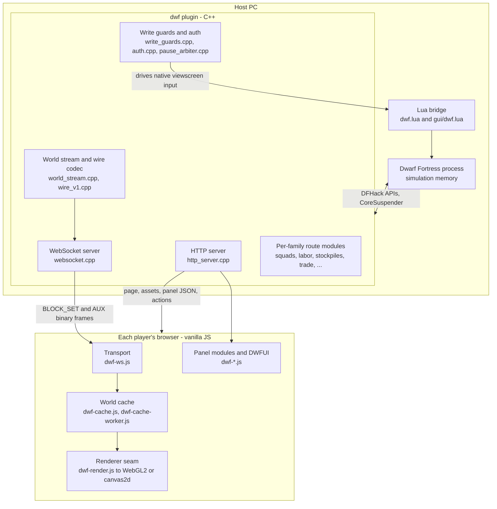

# Codebase map

A directory-and-file index for people who need to find the right file quickly. It complements
[ARCHITECTURE.md](ARCHITECTURE.md), which explains *why* the system is shaped this way, and the
per-directory `README.md` files, which carry the local rules. Names can mislead here; read
[NAMING.md](NAMING.md) before assuming a `dwf-*` or `dfcapture*` name means legacy code.

## Runtime architecture

One Dwarf Fortress process runs the simulation. The C++ plugin reads and mutates it under strict
locking and serves a browser client over HTTP and WebSocket. Each player's browser keeps its own
world cache, renderer, and camera.

```mermaid
flowchart TD
    subgraph hostpc[Host PC]
        DF["Dwarf Fortress process<br/>simulation memory"]
        LUA["Lua bridge<br/>dwf.lua and gui/dwf.lua"]
        subgraph plugin["dwf plugin - C++"]
            HTTP["HTTP server<br/>http_server.cpp"]
            WS["WebSocket server<br/>websocket.cpp"]
            WSTREAM["World stream and wire codec<br/>world_stream.cpp, wire_v1.cpp"]
            ROUTES["Per-family route modules<br/>squads, labor, stockpiles, trade, ..."]
            GUARD["Write guards and auth<br/>write_guards.cpp, auth.cpp, pause_arbiter.cpp"]
        end
    end
    subgraph client["Each player's browser - vanilla JS"]
        WSC["Transport<br/>dwf-ws.js"]
        CACHE["World cache<br/>dwf-cache.js, dwf-cache-worker.js"]
        REND["Renderer seam<br/>dwf-render.js to WebGL2 or canvas2d"]
        PANELS["Panel modules and DWFUI<br/>dwf-*.js"]
    end
    DF <-->|"DFHack APIs, CoreSuspender"| plugin
    GUARD -->|"drives native viewscreen input"| LUA
    LUA --> DF
    WSTREAM --> WS
    WS -->|"BLOCK_SET and AUX binary frames"| WSC
    HTTP -->|"page, assets, panel JSON, actions"| client
    WSC --> CACHE --> REND
    HTTP --> PANELS
```

## Top-level layout

| Path | Purpose |
|---|---|
| `src/` | The C++ DFHack plugin: transport, world reads, wire encoding, per-family routes, guards. See [src/README.md](../src/README.md). |
| `web/` | The zero-dependency browser client and its generated sprite/token JSON maps. See [web/README.md](../web/README.md). |
| `web/js/` | The client's plain-script modules. See [web/js/README.md](../web/js/README.md). |
| `host/` | Zero-dependency Node installer and host-management UI. See [host/README.md](../host/README.md). |
| `scripts/` | DFHack Lua entry points installed beside the plugin. See [scripts/README.md](../scripts/README.md). |
| `lua/` | The plugin's own Lua module tree, bundled into `dwf.lua` by `tools/lua/`. |
| `dwf.lua` | The plugin's Lua module, installed to `hack/lua/plugins/dwf.lua`; hosts the guarded native-write engine. |
| `tools/` | Source checks, asset maintenance, and packaging. |
| `third_party/` | Vendored dependencies: `cpp-httplib` (the embedded HTTP/WebSocket library) and `stb` (`stb_image_write.h`, the non-Windows PNG encoder). |
| `docs/` | Player guides, developer reference, and release notes. See [the index](README.md). |
| `media/` | Images the README and release notes embed. Product surface, not evidence. |
| `build-logs/` | Retained build evidence, and the one place a `.log` is source. Driver: `build-logs/build.ps1`. |
| `.github/` | Everything GitHub reads: CI workflows, issue and pull-request templates, and the community-health files. |
| `CMakeLists.txt` | Declares the external plugin target `dfcapture_public` with output name `dwf` (so the built artefact is `dwf.plug.dll`). |
| `AGENTS.md` | Mandatory safety contract for anyone changing the code. |

## `src/`: the C++ plugin

Every file carries the AGPL-3.0 header; purposes below come from each file's banner comment or,
where none exists, its leading code. `dwf.cpp` is the entry point: `DFHACK_PLUGIN("dwf")`,
`plugin_init` (registers the `capture-*` console commands), and `plugin_shutdown`. The HTTP server
starts separately in `http_server.cpp` and fans route registration out to the many
`register_*_routes()` modules. [src/README.md](../src/README.md) groups the same files by domain
with a one-line role each; the tables here carry the depth.

### Server, transport, and web serving

| File | Purpose |
|---|---|
| `http_server.cpp/.h` | HTTP server lifecycle (`start_server`/`stop_server`, default port 8765) and aggregation of every `register_*_routes`. |
| `websocket.cpp/.h` | In-process RFC 6455 WebSocket server subclassing cpp-httplib; drives protocol-v1 push. |
| `world_stream.cpp/.h` | Protocol-v1 global single read pass: one interest-union scan per tick, encode-once, distribute to N connections. |
| `wire_v1.cpp/.h` | Protocol-v1 binary codec: frame header, tile record, `BLOCK_SET` assembly (`encode_block`). |
| `web_assets.cpp/.h` | Locates and serves the on-disk web root (`hack/dfcapture-web`) and `index.html`. |
| `session_routes.cpp/.h` | Session and server-meta routes: `/`, `/view`, `/health`, `/version`, `/join`, `/state`, `/camera`, `/follow`, `/save`. |
| `console_routes.cpp/.h`, `console_policy.h` | Browser DFHack-console routes and the header-only command deny table; gated by a host setting. |
| `oracle_routes.cpp/.h` | Harness-only test routes: `/host-state`, `/zoom-probe`, `/frame.jpg`, `/tiledump`. |
| `sound_route.cpp/.h` | Serves the host's own DF soundtrack as ranged Ogg behind a remote-play licensing gate; wires `/music`. |
| `music_sync.cpp/.h` | Server-authoritative synced music state (one canonical track and elapsed time for all clients). |
| `json_util.cpp/.h`, `json_mini.cpp/.h`, `route_helpers.h` | JSON escaping and query-param helpers; the minimal JSON reader (`Doc`/`Value`) for config and request bodies; small shared route helpers. |
| `api_result.h`, `api_response.h` | `ApiResult<T>` (a value or a `{status, code, message}` error, no exceptions) and the helper that writes such a failure to the HTTP response. |
| `request_origin.cpp/.h` | Classifies a request as loopback, forwarded, or remote. The single source of host authority; host-only routes ask it rather than re-testing the peer IP. |
| `render_thread_wait.h` | Bounded wait for `runOnRenderThread` marshals: an unbounded `future.get()` deadlocks against `plugin_shutdown`, so every marshal a route can reach uses this. |

### World read, serialization, and render capture

| File | Purpose |
|---|---|
| `sdl_capture.cpp/.h` | The live camera model, render-thread coordination, capture locking, and the retained JPEG parity oracle. Owns `capture_state_mutex`. Not merely a screenshot module: see NAMING.md. |
| `tile_map_dump.cpp/.h` | Crash-safe tile streaming through stable map APIs to the older `wire:1` JSON `/mapdata` fallback. |
| `tile_dump.cpp/.h` | Render-buffer/atlas oracle tooling: one frame's tile-layer arrays plus a ground-truth PNG. |
| `image_encoder.cpp/.h` | Frame encoding to JPEG/PNG/BMP (GDI+ on Windows). |
| `sprite_map.cpp/.h` | Parses DF premium graphics raws into the token-to-sprite-cell lookup JSON the client renderer uses. |
| `curses_palette.cpp/.h` | DF's live 16-colour curses palette to RGB/JSON, shipped on the `/version` handshake. |
| `overlay_control.cpp/.h` | Disables and restores the DFHack `overlay` plugin while streaming. |
| `hud.cpp/.h` | The fort name/site/rank/population/happiness/food HUD payload. |
| `bake_sweep.cpp/.h`, `portrait_sweep.cpp/.h`, `unit_portrait.cpp/.h`, `unit_sprites.cpp/.h` | Paced, offscreen unit-portrait and per-unit-composite generation that never unpauses DF. |
| `texpos_conformance.cpp/.h` | `GET /texpos-conformance`: every texture position the loaded world stamped onto its own raws, plus the tile-page table that turns a texpos back into a (sheet, col, row) cell: so client art choices can be graded against native instead of against our own maps. |
| `sdl_dlsym.h` | Linux/macOS twin of the Windows SDL symbol lookups; resolves SDL2 render functions from the copy the game already loaded and never loads a second one. |
| `camera.h`, `frame.h`, `surface_z.h`, `tile_material.h`, `unit_status.h`, `unit_status_words.h`, `unit_face.h` | Small shared structs and helpers (viewport, captured frame, recenter-surface, tile material with construction precedence, overhead-status bitfields, happiness face). |

### Per-family gameplay panels and routes

| File | Purpose |
|---|---|
| `squads.cpp/.h` | Military squad routes. |
| `squad_emblem.cpp/.h` | Host-side emblem roll: calls native's own random-emblem generator (exe-pinned) so a squad no browser client ever drew still has native's symbol and colours persisted. |
| `stockpile_panel.cpp/.h` | Stockpile info/rename/remove/links/storage/category/repaint. |
| `building_zone.cpp/.h` | Building and civic-zone inspect panel and zone routes. |
| `burrows_panel.cpp/.h` | Burrows panel, routes, and change broadcast. |
| `work_orders.cpp/.h` | Manager work-order routes. |
| `labor.cpp/.h` | Labor / work-detail routes. |
| `standing_orders.cpp/.h`, `stone_use.cpp/.h` | Standing-orders toggles; economic-stone toggles. |
| `info_panel.cpp/.h` | Info panel tabs for buildings/units/artifacts/occupations. |
| `kitchen_panel.cpp/.h` | Kitchen cook/brew panel. |
| `hospital.cpp/.h` | Hospital and health management. |
| `trade_depot.cpp/.h` | Depot state, caravan roster, mark-for-trade and trade-request mutations. |
| `unit_sheet.cpp/.h`, `unit_activity.cpp/.h`, `unit_activity_logic.h` | Unit detail sheet, current-task resolution, and the activity-precedence template. |
| `fort_admin.cpp/.h` | Nobles/administrators, justice, and petitions/agreements routes. |
| `hauling.cpp/.h`, `lever_link.cpp/.h` | Hauling-route panel; lever-linkage routes. |
| `placement.cpp/.h` | Designation and building-placement routes. |
| `worldmap_panel.cpp/.h`, `missions.cpp/.h`, `world_site_readonly.h` | World-map overlay routes; missions/raids screen (`/mission-create` validates, then refuses behind a deliberate compile-time guard); the pinned site subtype. |
| `machines.cpp/.h` | `GET /machines`: DF's own power networks, read-only. Power totals are running sums DF maintains incrementally, so this module never writes them. |
| `siege_engines.cpp/.h` | One siege engine's state, its action mode, and the bolt thrower's resting facing. |
| `interaction.cpp/.h`, `interaction_route.h` | The `/inspect` click resolver and surface-click routing precedence. |
| `art_desc.cpp/.h`, `fort_stock.h` | Dwarven-art prose sourced only from DF fields; the shared item ownership-and-eligibility predicates, one named purpose per caller family. |

### Guards, auth, pause, and multiplayer coordination

| File | Purpose |
|---|---|
| `write_guards.cpp/.h` | C++ binding of the fail-closed `dfcapture-hostwrites.json` guards and the `/write-guards` and `/console-config` routes. |
| `auth.cpp/.h` | Join security: shared-passphrase gate and the version-mismatch build stamp. |
| `pause_arbiter.cpp/.h` | Debounces and merges pause requests, auto-pauses on player leave, and broadcasts saving/busy state. |
| `save_barrier.cpp/.h` | Holds plugin work off from DFHack's pre-save callback until DF has finished serializing world memory. |
| `ui_cache_purge.cpp/.h` | Clears the raw `df::building*` values DF's v50 sub-interfaces cache, so a deconstruct issued from the browser cannot leave the renderer virtual-calling a freed object. |
| `client_state.cpp/.h` | Per-player camera cache and follow-target state. |
| `attribution.cpp/.h` | Records which player created each building/order/stockpile/zone; surfaced via `/attrib`. |

### Lua bridge, diagnostics, and messaging

| File | Purpose |
|---|---|
| `lua_bridge.cpp/.h` | Bridge to the `plugins.dwf` Lua module: build catalog, placement, stuck-squad mission rescue, guarded console run. |
| `diagnostics.cpp/.h` | Capture diagnostics counters, host state, and flight logging. |
| `flight_recorder.cpp/.h`, `flight_recorder_v3.cpp/.h` | Passive recording of DF screen arrays and backing memory for the ground-truth pipeline. |
| `menu_oracle.cpp/.h` | Crash-safe native menu read path that quiesces both DF threads before copying widget state (harness-only). |
| `status_harvest.cpp/.h`, `status_truth.cpp/.h` | Passive overhead-status harvest; a live bubble-vs-sheet cross-check that catches a stale DLL. |
| `chat.cpp/.h`, `notifications.cpp/.h`, `announcements.cpp/.h`, `announce_taxonomy.gen.h` | Chat relay and scrollback; announcement-alert feed; the reports/announcements log and its generated taxonomy. |
| `native_popup.cpp/.h`, `diplo.cpp/.h` | Mirrors of DF's native modal popups (readable and dismissable in the browser); the petitions/diplomacy detector. |

## `web/js/`: the browser client

These are classic `<script>` files, not ES modules: each registers a global (an IIFE namespace
object such as `DwfWS`, or plain functions dropped into global scope). Load order is fixed by the
`<script>` tag order in `web/index.html`; there is no bundler and no `import`.

### Core and bootstrap

| Module | Purpose | Key global |
|---|---|---|
| `dwf-ui-components.js` | The shared component system (see [DWFUI](#dwfui-the-shared-component-system) below). | `DWFUI` |
| `dwf-core.js` | App bootstrap: camera and designation input, map-surface init, the global `player` key; exposes `startDwf`. | `DwfSpectate`, `startDwf` |
| `dwf-ws.js` | WebSocket push transport; decodes the v1 header and routes typed frames to consumer modules. | `DwfWS`, `DwfSessionInfo` |
| `dwf-wire-v1.js` | Pure protocol-v1 reference decoder, an exact mirror of `src/wire_v1.cpp`. | `DwfWireV1` |
| `dwf-cache.js`, `dwf-cache-worker.js` | The main-thread and worker halves of the chunked world cache. | `DwfCache` |
| `dwf-render.js` | Renderer seam that selects and supervises canvas2d or WebGL2. | `DwfRender` |
| `dwf-tiles.js` | The canvas2d tile renderer and presence roster. | `DwfTiles`, `DwfPresence` |
| `dwf-gl.js`, `dwf-gl-atlas.js` | The WebGL2 instanced-quad renderer and its texture-array atlas packer. | `DwfGL`, `DwfGLAtlas` |
| `dwf-join.js` | Join security and version-mismatch gate; boots the app through the join screen. | `DwfJoin`, `DwfAuth` |
| `dwf-interface-shell.js`, `dwf-control-shell.js` | Declarative markup for the persistent fortress chrome and the bottom toolbar/designation rows. | `DwfInterfaceShell`, `DwfControlShell` |
| `dwf-map-chrome-controls.js`, `dwf-designation-controls.js`, `dwf-tool-mode-controller.js` | Persistent map chrome, designation/tool state, keyboard dispatch, and the one-level back-out controller. | `DFPlacementController`, `DFBackOut`, `DFClientPrefs` |
| `dwf-stockpile-placement.js`, `dwf-zone-placement.js`, `dwf-burrow-panel.js`, `dwf-hauling-panel.js`, `dwf-map-target-modes.js`, `dwf-map-placement-input.js`, `dwf-map-hover.js` | Family placement/target modes, the central pointer dispatcher, and map hover. | `DFPlacementArmed`, `DFStockRepaint`, `DFZoneRepaint`, `DFBurrowSync` |
| `dwf-chrome.js` | Interface-sprite blit helper reading `interface_map.json`. | `DFChrome` |

### Render and text primitives

`dwf-adjacency.js` (wall-join/shadow tables), `dwf-animclock.js` (pause-aware world clock),
`dwf-farm-crops.js` (planted-crop resolver), `dwf-bitmap-text.js` (CP437 labels from the atlas),
`dwf-df-markup.js` (DF colour-markup parser), `dwf-overlay-boxes.js` and `dwf-burrow-overlay.js`
(building and burrow tile overlays), `dwf-weather.js` (rain/snow ambience).

One module owns each rule that canvas2d and WebGL2 must answer identically, so the two renderers
cannot drift: `dwf-grid.js` (cells to pixels), `dwf-edge-overgrowth.js` (floor-family overgrowth),
`dwf-grass-selection.js` (grass body selection), `dwf-terrain-variant.js` (native terrain variant),
`dwf-gem-variant.js` (runtime-composited cut gems). Input has the same shape:
`dwf-mode-stack.js` (the close law and back-out ladder), `dwf-gesture.js` (rectangle gestures),
`dwf-drag-preview.js` (drag preview), `dwf-paint-session.js` (paint/repaint session state),
`dwf-safety.js` (the safety-and-honesty foundations). Boot and join add `dwf-boot-health.js` (the
client's own load-failure honesty layer), `dwf-auth-gate.js` (holds protected fetches until
`DwfJoin` validates), and `dwf-digest.js` (the join-time "since you left" digest).

### Family ownership

Each gameplay family is owned by one module (some panels delegate to sub-panels):

| Family | Owning module(s) |
|---|---|
| Squads / military | `dwf-squad-panel.js` (overview/orders), `dwf-squad-positions.js`, `dwf-squad-equipment.js`, `dwf-squad-schedule.js`, `dwf-squad-emblem.js`, `dwf-squad-burrow-order.js`, and `dwf-squad-patrol-order.js` (map orders from `dwf-map-target-modes.js`) |
| Buildings / build menu | `dwf-build-panel.js`, `dwf-building-panel.js`, `dwf-machine-panel.js`, `dwf-siege-engine-panel.js`, `dwf-farm-plot-panel.js`, `dwf-lever-link-panel.js`, `dwf-workshop-panel.js`, `dwf-menu-tree.js` |
| Information panels | `dwf-info-panel.js`, `dwf-creatures-panel.js`, `dwf-vermin-panel.js`, `dwf-planned-engraving-panel.js`, `dwf-item-panel.js`, `dwf-stocks-panel.js`, `dwf-tasks-panel.js` |
| Zones / stockpiles | `dwf-zone-panel.js`, `dwf-stockpile-panel.js`, `dwf-stockpile-settings.js` (boxes from `dwf-overlay-boxes.js`) |
| Kitchen | `dwf-kitchen.js` |
| Hospital | `dwf-hospital-panel.js` |
| Trade | `dwf-tradedepot-panel.js` (depot), `dwf-tradescreen.js` (barter) |
| Labor and work orders | `dwf-labor-details.js` (work details), `dwf-standing-orders.js` (standing orders), `dwf-stone-use.js` (stone use), `dwf-work-orders.js` (manager work orders) |
| Nobles / justice / petitions | `dwf-fort-admin.js`, `dwf-obligations.js`, `dwf-diplo.js` |
| Locations | `dwf-location-panel.js` (camera bookmarks in `dwf-hotkeys.js`) |
| Announcements / reports | `dwf-announcements.js`, `dwf-announcement-viewer.js`, `dwf-local-panel-router.js`, `dwf-popup.js` (formatting in `dwf-announcement-format.js`, generated token table in `dwf-announce-taxonomy.js`) |
| World map / 3D view / missions | `dwf-worldmap.js`, `dwf-missions.js`; `dwf-world3d.js` with `dwf-world3d-model.js`, `dwf-voxelizer.js`, `dwf-voxel-mesh.js` |
| Help | `dwf-help-panel.js` (data in `dwf-help-corpus.js`, `dwf-help-curated.js`); `dwf-keymap.js` |
| Chat / lobby / console / analytics | `dwf-chat.js`, `dwf-lobby.js`, `dwf-console-panel.js`, `dwf-analytics-panel.js` |
| Settings / host panel / pause / esc menu | `dwf-settings.js`, `dwf-hostpanel.js`, `dwf-pause.js`, `dwf-escmenu.js` |
| Units / HUD / tooltips / audio / touch | `dwf-unit-portrait.js`, `dwf-unit-follow.js`, `dwf-unit-profile.js`, `dwf-fortress-hud.js`, `dwf-minimap.js`, `dwf-unitcycle.js`, `dwf-tooltip.js`, `dwf-audio.js`, `dwf-touch.js` |
| Attribution / write guards | `dwf-attribution.js`, `dwf-write-guards.js` |
| Panel framework | `dwf-panelframe.js`, `dwf-fort-panels.js` |

### DWFUI, the shared component system

`web/js/dwf-ui-components.js` is DWFUI: a dependency-free, declarative markup layer (config in,
escaped HTML out: no fetch, no DOM mutation, no listeners, no state). All product UI must go
through it; a missing primitive is added and tested in DWFUI, not hand-built inside a panel. It
also owns the single interface-scale source of truth and the native sprite/art mounting helpers.
Panels declare the builders they use via `require(surface, [names])`.

Its builders include rows and row groups, tabs, plaques, buttons, search and text inputs, dialogs
and modals, switches, radio and segmented groups, scrollbars, grids, stat tiles, bitmap text, and
`rawHtml(reason, html)` as the single audited escape hatch. The `.dwfui-*` classes and `--dwfui-*`
tokens live in `web/css/dwf-dwfui.css` and `web/css/dwf-tokens.css`.

## Source checks and packaging

`tools/harness/wire_decode_test.mjs` checks the browser decoder against a known fixture.
`tools/lua/build_dwf_lua.mjs` assembles and checks the Lua module.
`tools/harness/stamp_busters.mjs` and `tools/architecture/browser_dependency_inventory.mjs` maintain browser asset hashes and load-order inventory.
`tools/release/build_zip.mjs` creates the Windows and Linux archives.
